## Сирык Максим Анатольевич 	ИС 22-9/1

## 2.
База данных парикмахерской, в которую входит 6 таблиц:
* Appointment(Назначения);
* Clients(Данные о клиентах);
* Employees(Данные о сотрудниках);
* Feedback(Отзывы);
* Payments(Оплата);
* Services(Данные о стрижках).


## 2.1
Таблица Appointments, содержащая атрибуты:
* AppointmentID(Айди назначения, настроен по умолчанию, int);
* DateTime(График работы, date);
* ClientID(Айди клиента, int);
* EmployeeID(Айди сотрудников, int);
* ServiceID(Айди сервиса, int).

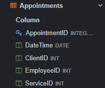		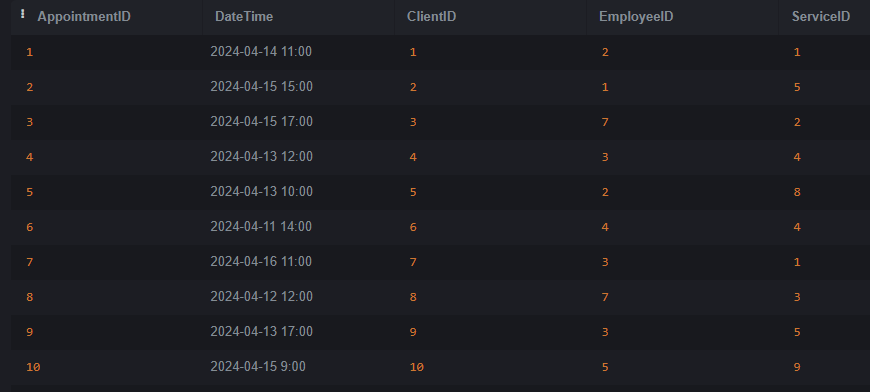

Таблица Сlients содержащая атрибуты:
* ClientID(Айди клиента, настроен по умолчанию, int);
* Name(Имя, varchar(255));
* Surname(Фамилия, varchar(255);
* PhoneNumber(Номер телефона, varchar(255));
* Email(Эл. почта, varchar(255));
* Gender(Пол, varchar(255)).

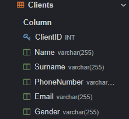		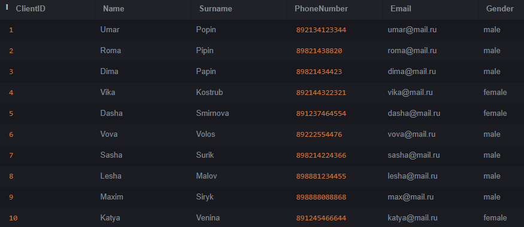

Таблица Employees содержащая атрибуты:
* EmployeeID(Айди сотрудника, настроен по умолчанию, int);
* Name(Имя, varchar(255));
* Surname(Фамилия, varchar(255));
* PhoneNumber(Номер телефона, varchar(255));
* Email(Эл. почта, varchar(255));
* Schedule(График работы, varchar(255));
* Gender(Пол, varchar(255)).

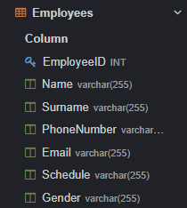		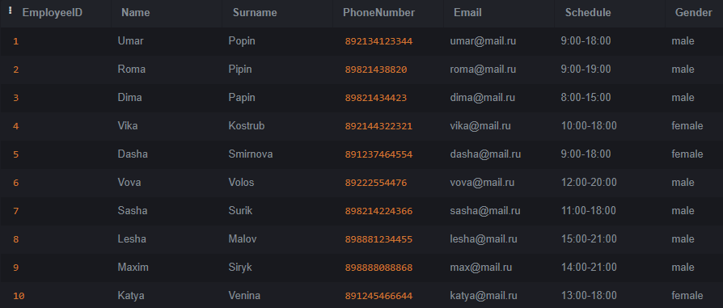

Таблица Feedback содержащая атрибуты:
* FeedbackID(Айди отзыва, настроен по умолчанию, int);
* ClientID(Айди клиента, int);
* ReviewText(Текст, text);
* Rating(Рейтинг, int).

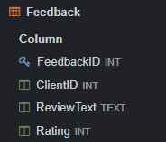   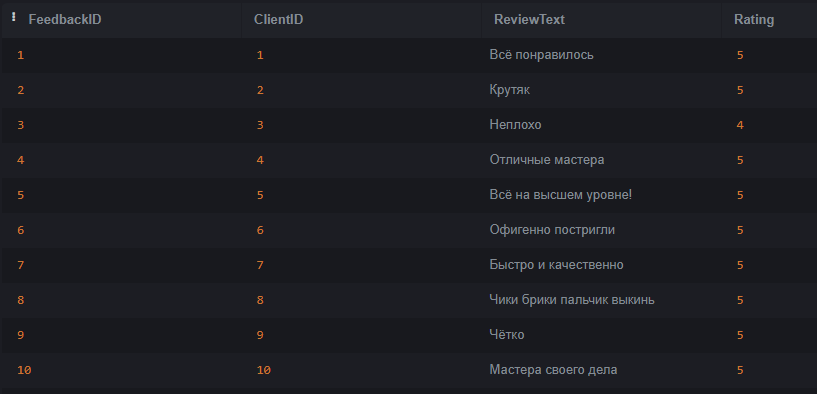

Таблица Payments содержащая атрибуты:
* PaymentID(Айди оплаты, настроен по умолчанию, int);
* FeedbackID(Айди отзыва, int);
* PaymentAmount(Сумма к оплате, decimal(10,2));
* PaymentDateTime(Дата оплаты, date).

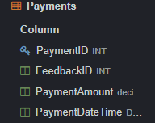		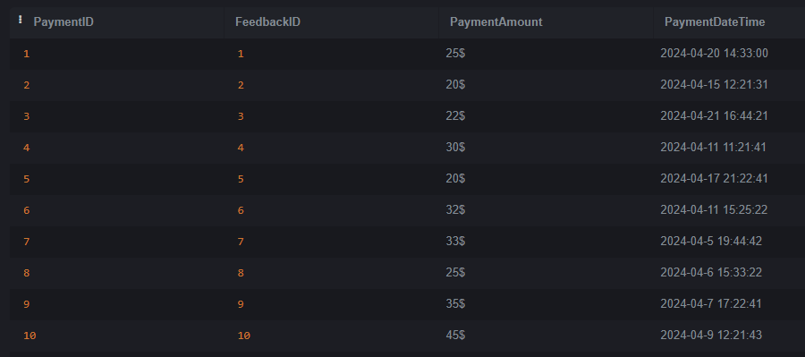

Таблица Services содержащая атрибуты:
* ServiceID(Айди стрижки, настроен по умолчанию, int);
* Description(Описание, text);
* Price(Стоимость, decimal(10,2));
* EmployeeID(Айди сотрудника, int).

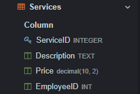		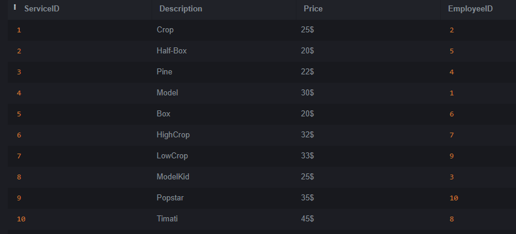


## 3. Демонстрация работы функции UNION
Объединение двух наборов строк. Я объединил Name и Surname из таблицы Clients.
```
SELECT Name AS Имя_И_Фамилия_Клиента
FROM Clients
UNION
SELECT Surname AS Имя_И_Фамилия_Клиента
FROM Employees;
```

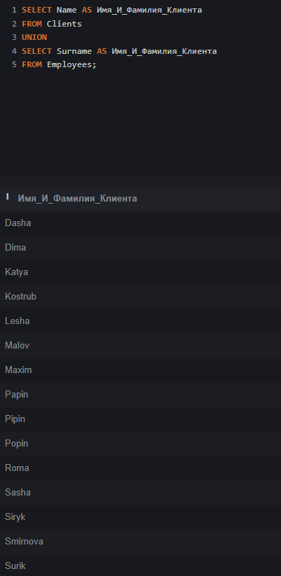


## 4. Демонстрация работы функции ORDER BY
Сортировка данных. Я отсортировал стоимость стрижки по возрастанию.
```
SELECT Price, description
FROM Services
ORDER BY Price ASC
```

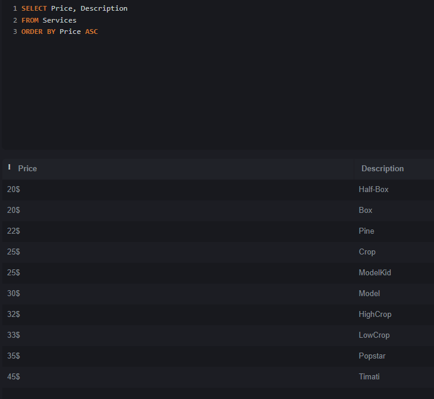


## 5. Демонстрация работы функции HAVING
Я отфильтровал результаты, где стоимость стрижки больше 25.
```
SELECT description, AVG(Price) AS Средняя_Стоимость FROM Services
GROUP BY description
HAVING Средняя_Стоимость > 25
```

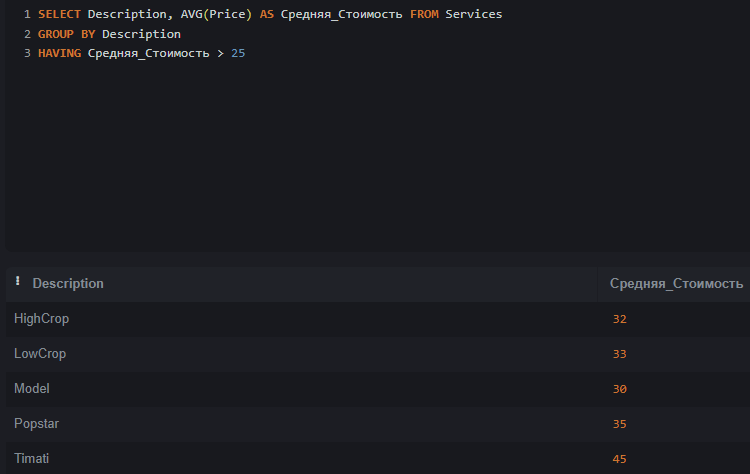


## 6. Демонстрация работы вложенных запросов
### 6.1. В SELECT
Вывел клиента, чье имя Roma из таблицы Клиентов
```
SELECT name
FROM Clients
WHERE name = 
	(SELECT name
     from Clients
     WHERE Name = 'Roma');
```

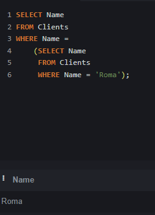

### 6.1. В WHERE
Вывел имена клиентов, чье имя не заканчивается на букву 'а'
```
SELECT Name
FROM Clients
WHERE Name NOT LIKE '%a'
```

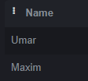

