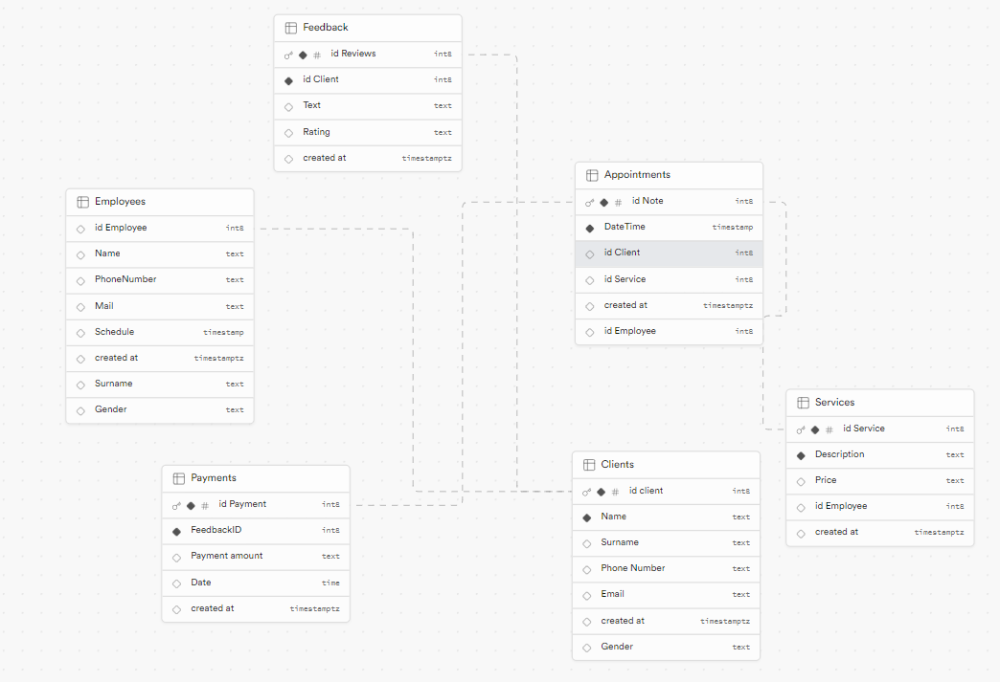

## Сирык Максим Анатольевич 	ИС 22-9/1

## 2.
База данных парикмахерской, в которую входит 6 таблиц:
* Appointment(Назначения);
* Clients(Данные о клиентах);
* Employees(Данные о сотрудниках);
* Feedback(Отзывы);
* Payments(Оплата);
* Services(Данные о стрижках).


## 2.1
Таблица Appointments, содержащая атрибуты:
* AppointmentID(Айди назначения, настроен по умолчанию, int);
* DateTime(График работы, date);
* ClientID(Айди клиента, int);
* EmployeeID(Айди сотрудников, int);
* ServiceID(Айди сервиса, int).

		

Таблица Сlients содержащая атрибуты:
* ClientID(Айди клиента, настроен по умолчанию, int);
* Name(Имя, varchar(255));
* Surname(Фамилия, varchar(255);
* PhoneNumber(Номер телефона, varchar(255));
* Email(Эл. почта, varchar(255));
* Gender(Пол, varchar(255)).

		

Таблица Employees содержащая атрибуты:
* EmployeeID(Айди сотрудника, настроен по умолчанию, int);
* Name(Имя, varchar(255));
* Surname(Фамилия, varchar(255));
* PhoneNumber(Номер телефона, varchar(255));
* Email(Эл. почта, varchar(255));
* Schedule(График работы, varchar(255));
* Gender(Пол, varchar(255)).

		

Таблица Feedback содержащая атрибуты:
* FeedbackID(Айди отзыва, настроен по умолчанию, int);
* ClientID(Айди клиента, int);
* ReviewText(Текст, text);
* Rating(Рейтинг, int).

   

Таблица Payments содержащая атрибуты:
* PaymentID(Айди оплаты, настроен по умолчанию, int);
* FeedbackID(Айди отзыва, int);
* PaymentAmount(Сумма к оплате, decimal(10,2));
* PaymentDateTime(Дата оплаты, date).

		

Таблица Services содержащая атрибуты:
* ServiceID(Айди стрижки, настроен по умолчанию, int);
* Description(Описание, text);
* Price(Стоимость, decimal(10,2));
* EmployeeID(Айди сотрудника, int).

		


## 3. Демонстрация работы функции UNION
Объединение двух наборов строк. Я объединил Name и Surname из таблицы Clients.
```
SELECT Name AS Имя_И_Фамилия_Клиента
FROM Clients
UNION
SELECT Surname AS Имя_И_Фамилия_Клиента
FROM Employees;
```


## 4. Демонстрация работы функции ORDER BY
Сортировка данных. Я отсортировал стоимость стрижки по возрастанию.
```
SELECT Price, description
FROM Services
ORDER BY Price ASC
```


## 5. Демонстрация работы функции HAVING
Я отфильтровал результаты, где стоимость стрижки больше 25.
```
SELECT description, AVG(Price) AS Средняя_Стоимость FROM Services
GROUP BY description
HAVING Средняя_Стоимость > 25
```


## 6. Демонстрация работы вложенных запросов
### 6.1. В SELECT
Вывел клиента, чье имя Roma из таблицы Клиентов
```
SELECT name
FROM Clients
WHERE name = 
	(SELECT name
     from Clients
     WHERE Name = 'Roma');
```


### 6.1. В WHERE
Вывел имена клиентов, чье имя не заканчивается на букву 'а'
```
SELECT Name
FROM Clients
WHERE Name NOT LIKE '%a'
```


## 7. Демонстрация работы оконных функций:
### 7.1. Агрегатные функции
С помощью функции MIN я нашел минимальную стоимость стрижки, с помощью функции MAX я нашел максимальную стоимость стрижки, с помощью функции SUM я нашел суммарную стоимость стрижек, с помощью функции AVG я нашел среднюю стоимость стрижки, с помощью функции COUNT я подсчитал количество рейтингов, равному 5
```
SELECT 
    MIN(Price) AS Минимальная_стоимость,
    MAX(Price) as Максимальная_стоимость,
    SUM(Price) as Сумма,
    AVG(Price) as Средняя_стоимость,
    (SELECT COUNT(*) FROM Feedback WHERE Rating = 5) as Рейтинг_5 
FROM Services
```


### 7.2. Ранжирующие функции

```
SELECT serviceid,
	description,
	price,
	ROW_NUMBER() OVER(PARTITION BY description ORDER BY price) AS 'row_number',
	RANK() OVER(PARTITION BY description ORDER BY price) AS 'rank',
	DENSE_RANK() OVER(PARTITION BY description ORDER BY price) AS 'dense_rank'
FROM Services;
```


### 7.3. Функции смещения

```
SELECT serviceid,
	description,
	price,
	LAG(price) OVER(PARTITION BY description ORDER BY price) AS 'lag',
	LEAD(price) OVER(PARTITION BY description ORDER BY price) AS 'lead',
	FIRST_VALUE(price) OVER(PARTITION BY description ORDER BY price) AS 'first_value',
	LAST_VALUE(price) OVER(PARTITION BY description ORDER BY price) AS 'last_value'
FROM Services;
```


## 8. Демонстрация работы JOIN'ов:
### 8.1. INNER JOIN
Возвращает те строки, для которых в обеих таблицах выполняется условие соединения.
```
SELECT Name, reviewtext
FROM Clients JOIN Feedback ON Feedback.ClientID = Clients.ClientID
```


### 8.2. LEFT JOIN
Возвращает строки, содержащие данные из левой таблицы, даже если в правой таблице нет совпадающих строк.
```
SELECT Name, reviewtext
FROM Clients LEFT JOIN Feedback ON Feedback.ClientID = Clients.ClientID
```


### 8.3. RIGHT JOIN
Возвращает строки, содержащие данные из правой таблицы, даже если в левой таблице нет совпадающих строк.
```
SELECT Name, reviewtext
FROM Clients RIGHT JOIN Feedback ON Feedback.ClientID = Clients.ClientID
```


### 8.4. FULL JOIN
Возвращает строки, содержащие данные из обеих таблиц.
```
SELECT Name, reviewtext
FROM Clients FULL JOIN Feedback ON Feedback.ClientID = Clients.ClientID
```


### 8.5. CROSS JOIN
Возвращает строки, содержащие все возможные комбинации левой и правой частей соединения.
```
SELECT Name, reviewtext
FROM Clients CROSS JOIN Feedback ON Feedback.ClientID = Clients.ClientID
```


## 9. Демонстрация работы CASE
Оператор позволяет осуществить проверку условий и возвратить в зависимости от выполнения того или иного условия тот или иной результат.
```
SELECT Name,
	CASE
    	WHEN Gender = 'male' THEN 'Мужчина'
        ELSE 'Женщина'
    END AS Пол 
FROM Clients
```


## 10. Демонстрация работы WITH
Используется для создания временных таблиц, которые можно использовать внутри запросов (trap).
```
WITH trap AS
(SELECT Name, Email FROM Clients)
SELECT * FROM trap
```


